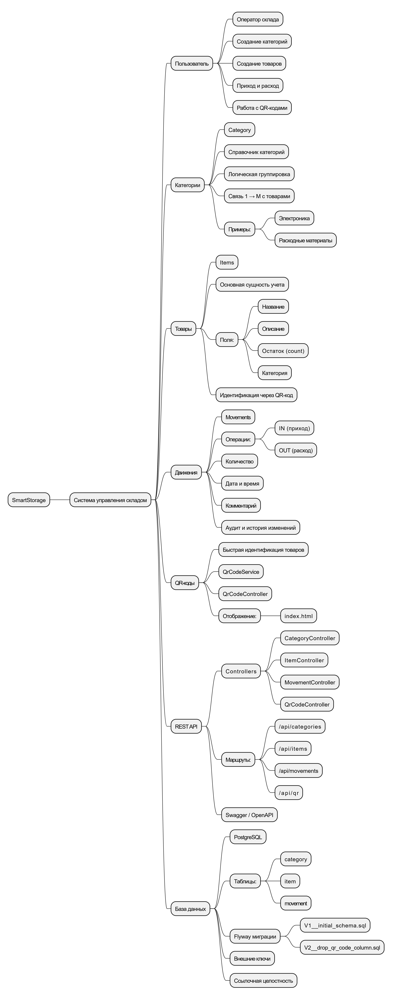

## 2.2. Ментальная карта (с комментариями)

## Ментальная карта SmartStorage

Данная диаграмма позволяет:
- получить общее представление о функциональности системы;
- выделить основные сущности предметной области;
- показать взаимодействие пользователя, REST API и базы данных;
- упростить понимание архитектуры перед детальным UML-моделированием.