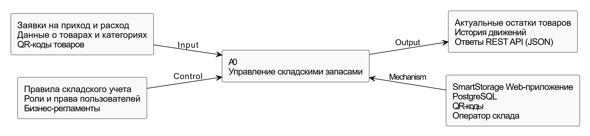
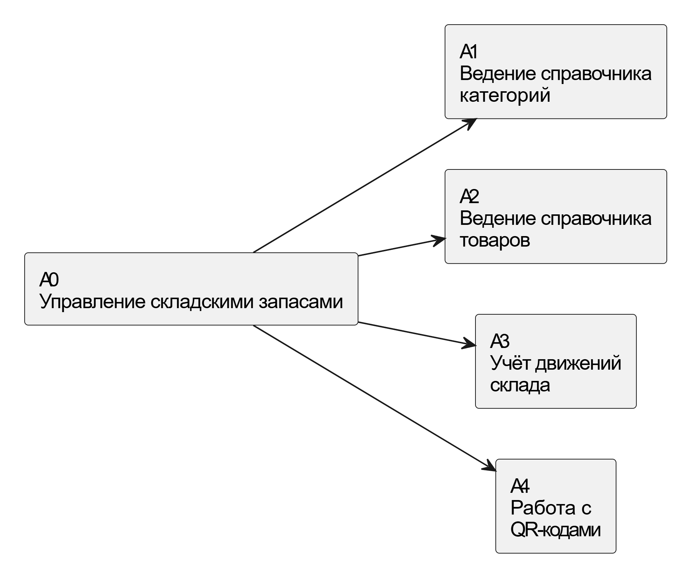

## 2.3. Модель в нотации IDEF0 (с комментариями)

### 2.3.1. Контекстная диаграмма A0

**Функция A0:** Управление складскими запасами

**Входы (Input):**
- Заявки на поступление и отгрузку товаров.
- Данные о товарах и категориях.
- QR-коды товаров.

**Управление (Control):**
- Правила складского учета.
- Роли и права пользователей.
- Регламенты бизнес-процессов компании.

**Механизмы (Mechanism):**
- Веб-приложение SmartStorage.
- СУБД PostgreSQL.
- Средства генерации и считывания QR-кодов.
- Оператор склада.

**Выходы (Output):**
- Актуальные остатки товаров на складе.
- История движений товаров.
- Ответы REST API в формате JSON.

---

### 2.3.2. Декомпозиция функции A0

**Функция A0** «Управление складскими запасами» декомпозируется на следующие
подфункции:

- A1 — Ведение справочника категорий
- A2 — Ведение справочника товаров
- A3 — Учёт движений склада
- A4 — Работа с QR-кодами

