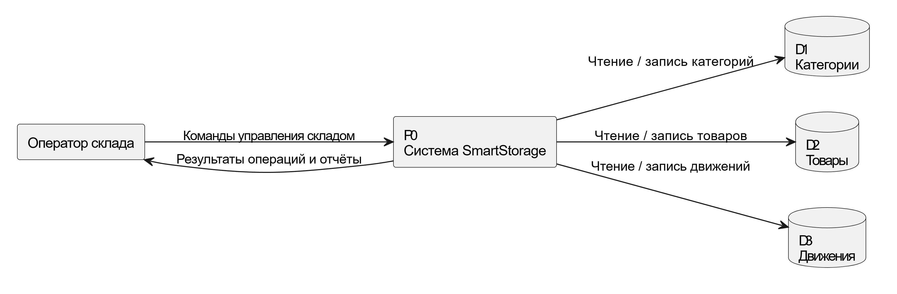
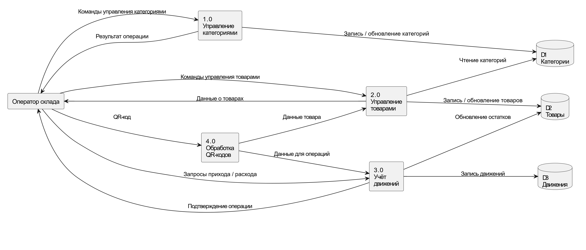

## 2.4. Фрагменты модели в нотации DFD (с комментариями)

### 2.4.1. Контекстная диаграмма DFD (уровень 0)

**Внешняя сущность:**
- Оператор склада.

**Процесс:**
- **P0** — Система SmartStorage.

**Хранилища данных:**
- **D1** — Категории.
- **D2** — Товары.
- **D3** — Движения.

**Основные потоки данных:**
- Оператор → P0: команды управления складом.
- P0 → Оператор: результаты операций и отчёты.
- P0 ↔ D1, D2, D3: чтение и запись данных категорий, товаров и движений.

---

## 2.4.2. DFD уровня 1 (фрагменты)

***На уровне 1 процесс P0 «Система SmartStorage» декомпозируется
на следующие подпроцессы:***

- 1.0 — Управление категориями
- 2.0 — Управление товарами
- 3.0 — Учёт движений
- 4.0 — Обработка QR-кодов

Хранилища данных остаются неизменными: D1 «Категории», D2 «Товары», D3 «Движения».

