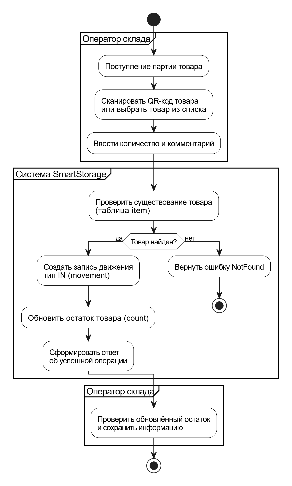

## 2.5. Модель в нотации BPMN (с комментариями)

### Участники процесса (Pools / Lanes)

В процессе участвуют следующие дорожки (lanes):

- **Оператор склада** — инициирует процесс и вводит данные о приходе товара.
- **Система SmartStorage** — выполняет проверку данных и обновление информации в базе данных.

---

### Описание бизнес-процесса

Процесс регистрации прихода товара включает следующие шаги:

1. Поступление партии товара (старт процесса).
2. Идентификация товара оператором (сканирование QR-кода или выбор из списка).
3. Ввод количества товара и комментария.
4. Проверка существования товара в системе.
    - В случае отсутствия товара процесс завершается с ошибкой.
    - В случае успешной проверки выполняется регистрация прихода.
5. Создание записи движения с типом IN и обновление остатка товара.
6. Формирование ответа об успешном выполнении операции.
7. Проверка оператором обновлённого остатка.
8. Завершение процесса.

---

### BPMN-диаграмма бизнес-процесса «Регистрация прихода товара»

