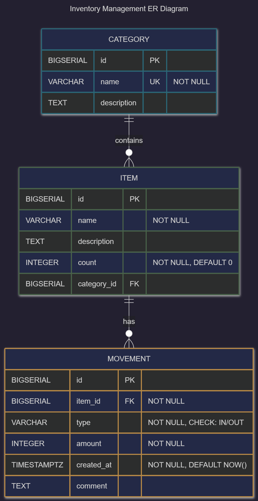

## 2.7. ER диаграмма

### Визуальное представление:

### Сущности и атрибуты:

**CATEGORY**
- `id` (PK, BIGSERIAL)
- `name` (NOT NULL, UNIQUE)
- `description` (TEXT, NULL)

**ITEM**
- `id` (PK, BIGSERIAL)
- `name` (NOT NULL)
- `description` (TEXT)
- `count` (INTEGER NOT NULL, DEFAULT 0)
- `category_id` (FK → CATEGORY.id)

**MOVEMENT**
- `id` (PK, BIGSERIAL)
- `item_id` (FK → ITEM.id, NOT NULL, ON DELETE CASCADE)
- `type` (VARCHAR(20), NOT NULL, значения 'IN'/'OUT')
- `amount` (INTEGER NOT NULL)
- `created_at` (TIMESTAMPTZ NOT NULL, DEFAULT NOW())
- `comment` (TEXT, NULL)

### Связи:
- **CATEGORY (1) — (N) ITEM** - Одна категория содержит много товаров
- **ITEM (1) — (N) MOVEMENT** - Один товар имеет много движений