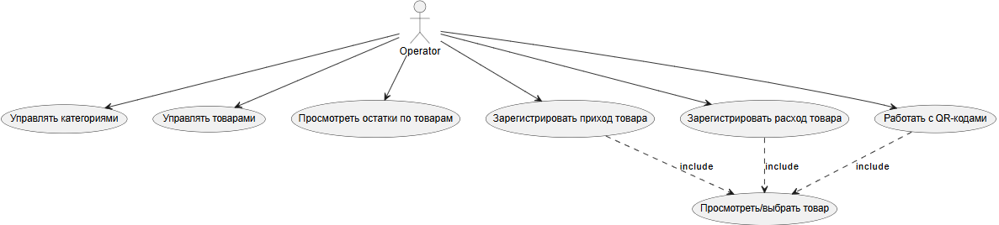
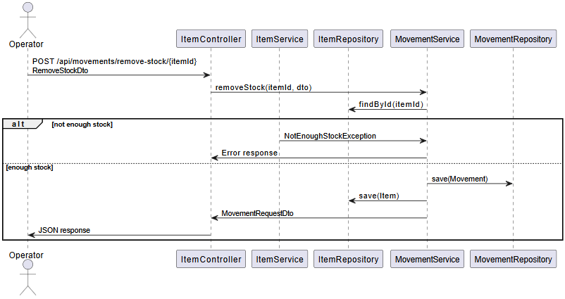

# 2.6. Модели в нотации UML

## 2.6.1. UML диаграмма классов (структурная)

**Комментарий:**  
Диаграмма классов показывает структуру доменной модели и связи между сущностями, а также разделение на слои (контроллеры, сервисы, репозитории).

---

## 2.6.2. UML диаграмма прецедентов (Use Case) — поведенческая

**Комментарий:**  
Use Case диаграмма отображает функциональные возможности системы с точки зрения пользователя и помогает убедиться, что реализованы все ключевые сценарии работы склада.

---

## 2.6.3. UML диаграмма последовательности (Sequence) — поведенческая

**Сценарий:** «Регистрация расхода товара»

**Комментарий:**  
Диаграмма последовательности демонстрирует взаимодействие между слоями при выполнении операции расхода товара и показывает, на каком этапе происходит проверка остатков и обработка ошибок.
