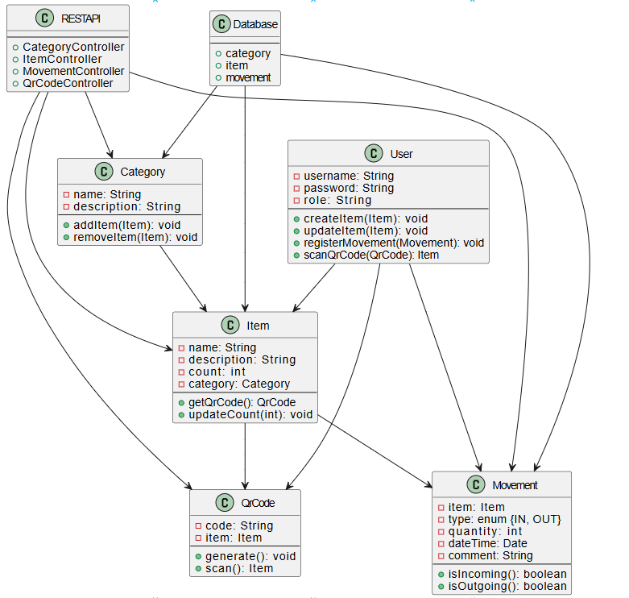

# SmartStorage — Ментальная карта

## Диаграмма ментальной карты

### Визуальное представление:

Диаграмма отражает основные сущности SmartStorage, их связи и поток действий: оператор использует REST API и QR-коды для управления категориями, товарами и движениями, а данные сохраняются в PostgreSQL.
